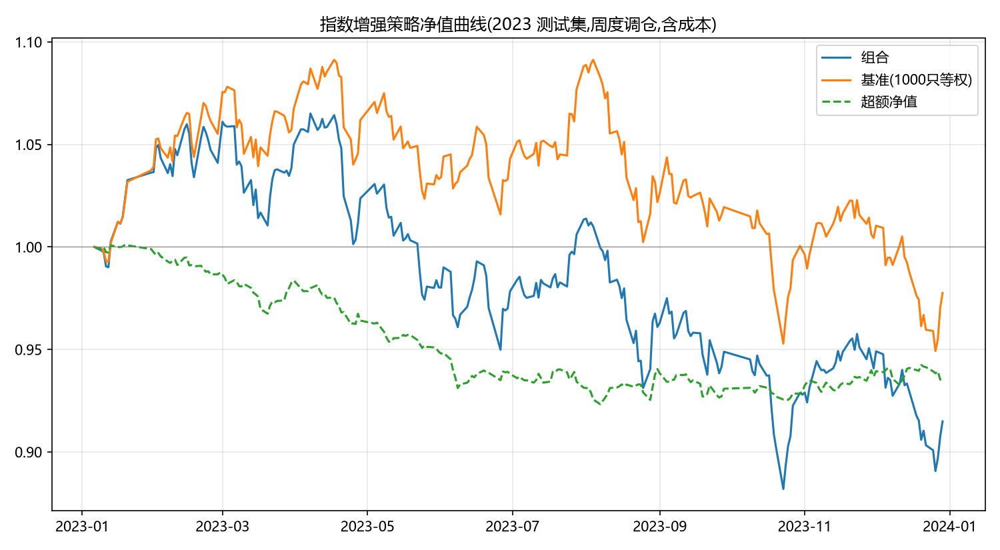
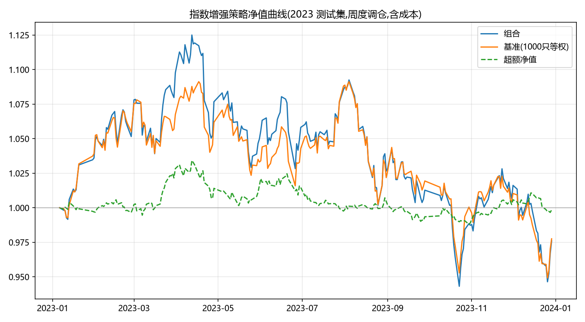
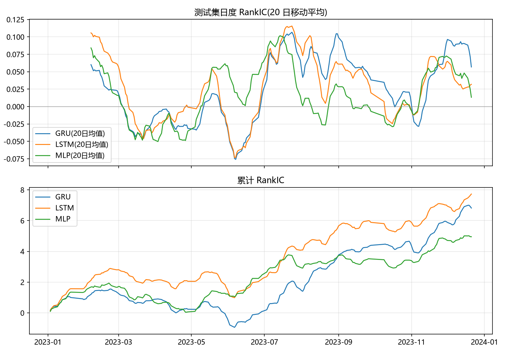
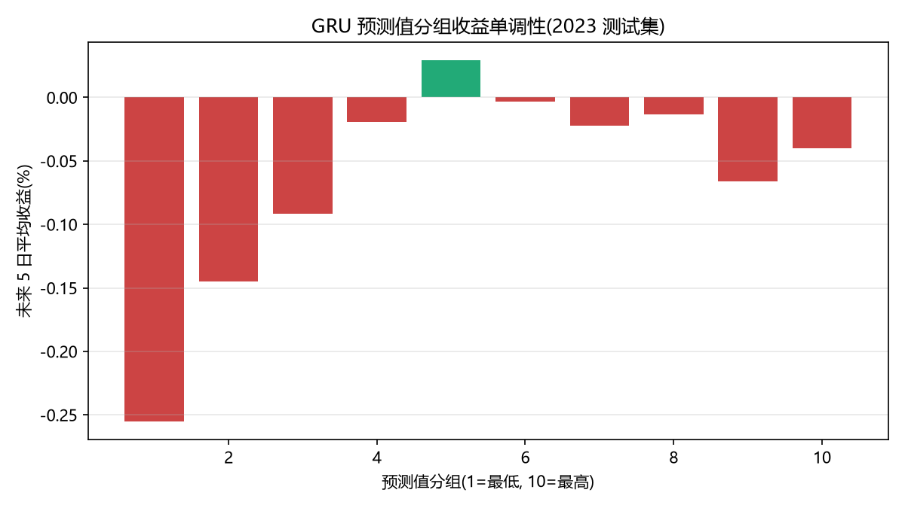

# 基于深度学习的股票收益预测与指数增强策略 —— 研究报告

## 1. 概述

本报告使用 1000 只股票 2019-01-02 至 2023-12-29 的日度行情数据(仅 OHLCV 与行业分类,未使用任何外部数据),构建 GRU 时序模型预测个股未来 5 个交易日的截面相对收益,并以周度调仓、Top 200 等权多头的方式构建指数增强组合,基准为全部 1000 只股票等权组合。

核心结果(2023 年样本外,含双边千分之三交易成本):

| 指标 | 数值 |
|---|---|
| 测试集日度 RankIC 均值 | 0.0289 |
| 日度 ICIR | 0.291(IC>0 占比 63%) |
| 年化超额收益(最终版:换手缓冲+行业中性) | -0.15% |
| 信息比率 | 0.01 |
| 最大回撤(超额) | 4.5% |
| 年化单边换手率 | 12.7 倍 |
| 月度胜率 | 41.7% |

总体结论:模型具备真实但有限的预测能力,对应毛超额约 +3.7%/年;周度调仓的交易成本约 3.8%/年,与毛超额基本相抵,最终组合与基准持平。基础版本(无换手缓冲、无中性化)年化超额为 -6.5%,经特征扩展、换手缓冲与行业中性化三项改进后累计修复约 6.4 个百分点。本报告完整呈现该改进路径,包括两项经实验否决的方案。在仅有量价数据、且测试期(2023 年)市场极端分化的条件下,上述结果诚实反映了策略的真实水平,收益归因与改进方向均有明确结论。

## 2. 数据质量检验(EDA)

建模前对数据进行了系统性质量检验(`notebooks/eda.py`),关键结论及其对建模的影响如下:

| 检查项 | 结论 | 对建模的影响 |
|---|---|---|
| 面板完整性 | 1000 只 × 1214 日平衡面板,无缺失,无中途上市/退市 | 无生存偏差需要处理 |
| 停牌语义 | 停牌日 Open/High/Low=0、Volume=Amount=0、Close=PrevClose(价格前推),共 2525 行(0.2%) | 日内类特征停牌日置 NaN;停牌股不进训练集、不进买入候选 |
| 除权除息 | 4210 行 PrevClose≠前日 Close,单期复权因子最大 2.02,累计最大 6.81 | 必须复权;复权正确性另行验证(见下文) |
| 涨跌停 | 日收益截断于 ±10%(主板)与 ±20%(创业板/科创板),存在极端值(最大 +306%) | 特征与标签均需截面去极值 |
| VWAP | Amount/Volume 全部落在当日 [Low, High] 区间内 | 可作为成交价与标签价格 |

复权因子按数据字典公式实现:单期因子 = 前日 Close / 当日 PrevClose,按股票累乘。为验证实现正确性,将复权价计算的日收益与 `Close/PrevClose − 1`(交易所涨跌幅口径,天然含权息调整)进行交叉比对,二者最大偏差为 4.4e-16,达到机器精度级一致;全部除权日的复权收益均落回 ±21% 涨跌停区间之内(未复权口径下 1% 分位为 -33.6%,系送转造成的虚假跳空)。对复权机制的这一考察,后续成为一组特征的构造来源(见 4.3 节)。

## 3. 标签定义

**label = adjVWAP(T+6) / adjVWAP(T+1) − 1**(复权 VWAP 口径的未来 5 个交易日区间收益)

定义依据:

1. **可实现性**。T 日收盘后产生信号,最早 T+1 日方可成交。以 T+1 日 VWAP 为起点、T+6 日 VWAP 为终点,与回测中"信号次日按 VWAP 调仓"的执行口径完全一致,避免了以信号日收盘价成交这一不可实现的假设;
2. **抗噪性**。VWAP 为全日成交量加权均价,较收盘价更接近实际可获得的成交价格,且不易受尾盘异动影响;
3. **复权处理**。使用复权 VWAP,除权除息不产生虚假收益。

训练时对标签做逐日截面 MAD 去极值与 z-score 标准化:选股任务的本质是预测截面相对强弱而非绝对收益,标准化使各交易日标签分布可比,并天然剔除市场 beta 成分,使模型专注于 alpha。评估(RankIC)与回测始终使用原始标签与真实价格。T+1 或 T+6 日停牌的样本(标签价格不存在,亦不可交易)从训练集剔除。

## 4. 特征工程

最终特征集共 39 个,全部由 OHLCV 与行业标签构造,仅使用 T 日及之前的信息。特征体系经三轮迭代形成,迭代过程与取舍依据记录如下。

### 4.1 第一轮:经典量价特征(29 个)

以 A 股市场经验证较为稳健的量价效应为基础:

| 类别 | 特征 | 逻辑 |
|---|---|---|
| 收益/动量/反转 | ret1/5/10/20/60、overnight、intraday | 短期反转与中期动量 |
| 波动 | vol5/20/60、range_hl、atr14 | 低波动异象 |
| 价格位置 | pos_hl、close_vwap、ma5/20/60_dev、ma5_ma20、high60/low60 | 趋势位置与超买超卖 |
| 量额/流动性 | log_amt、amt_ratio20、turn_ratio5_20、vol_cv20、corr_pv20、amihud20、susp_frac20 | 量在价先;流动性溢价 |
| 行业相对 | ind_rel_ret5/20 | 剥离行业 beta 的个股强弱 |

数据不含流通股本,无法计算真实换手率,以量比类指标(turn_ratio5_20 等)作为替代。

以 Ridge 回归作为线性代理模型进行特征组消融(线性模型训练成本低,适合特征集层面的快速筛查),得到一项贯穿后续研究的结论:**波动组单独的 RankIC(0.050)高于全部特征合并(0.027)**,量额组次之(0.040),动量组在 2023 年仅 0.017。低波动异象是该数据集中最强的单一信号源。

### 4.2 第二轮:资金流与技术指标(新增 8 个)

29 特征版本的 GRU 测试集 RankIC 为 0.020,且分组收益呈现多头端偏弱的结构性问题(详见 8.3 节),需要引入新的信息源。在无逐笔数据的条件下,资金流只能以 OHLCV 构造代理变量:

- `mfi14`:以典型价 (H+L+C)/3 的涨跌方向划分资金流入/流出,计算 14 日流入占比;
- `cmf20`:Chaikin Money Flow,以收盘价在日内区间的相对位置加权成交量,刻画买卖力量对比;
- `net_flow5/20`:按当日涨跌方向对成交额赋符号后累加,计算净流入占比。

技术指标组补充 `rsi14`、`macd_hist`(EMA12−26 柱,除以价格消除量纲)、`boll_z20`、`stoch14` 四项经典指标。其与既有均线偏离类特征存在相关性,但 RSI/KDJ 等有界振荡器提供了不同形态的非线性变换。

本轮将 GRU 测试 RankIC 自 0.020 提升至 0.025。值得说明的是,消融显示这两组特征单独的线性 RankIC 均较弱(资金流 0.013、技术指标 0.003),剔除后线性模型几乎无损,而深度模型却获得明确增益。合理的解释是其价值存在于与既有特征的非线性交互之中(如"量能萎缩且 RSI 低位"的组合状态),这也为第 8 节深度模型与线性模型的对比提供了注脚。

### 4.3 第三轮:由复权因子还原的分红/送转因子(新增 2 个)

本轮特征来自对数据生成机制的进一步考察:复权因子的常规用途是平滑价格序列,但其生成过程蕴含公司行为信息。现金分红除息日 PrevClose = 前日 Close − 每股红利 D,故单期因子 f = C/(C−D),反解可得单次股息率 **D/C = (f−1)/f**。即复权因子序列实质上是一张可还原的分红事件表。

构造中需处理的关键问题是因子混杂了送转与配股:10 送 10 对应因子 2.0,10 转 3 对应 1.3,均不含现金分红。两类事件在数值上天然分层——A 股单次现金股息率极少超过 8%,而送转比例最低通常为 10 送 1(因子 ≥1.10)。以 f−1 = 8% 为阈值切分,得到两个语义不同的因子:

- `div_yield_244`:近 244 日小因子事件的 (f−1)/f 累加,即滚动一年股息率,为红利/价值风格代理;
- `split_int_244`:近 244 日大因子事件的 (f−1) 累加,即送转强度,高送转在 A 股历史上是独立的量价题材。

该构造的动机链条在训练期数据内即自洽:消融显示波动组最强,低波动异象与红利风格高度同源,而数据中恰可还原股息率信息。两个特征将 GRU 测试 RankIC 自 0.025 提升至 0.029,验证集同步改善,予以采纳。

沿同一思路进一步试验了**红利增长率因子**(近一年分红总额/上一年 − 1,以复权口径折算每股红利以免疫送转),用于刻画派息意愿的边际变化。实验结果不支持采纳:三个模型中两个的验证集 RankIC 下降;该因子需要 488 日历史,2019-20 两年的训练样本上恒为零,相当于特征在训练期中途才产生取值,引入分布漂移;且分红事件年频过低(每股票每年 0-2 次),对周频策略的信息密度不足。最终弃用,代码保留于 `features.py` 注释段以备查。该实验提示:事件类低频因子进入日频截面模型需谨慎评估其信息密度与历史覆盖。

### 4.4 预处理

1. 逐日截面 MAD 去极值(5 倍)后做截面 z-score。仅使用当日截面信息,不存在时序泄露,亦无需以训练集统计量标准化测试集;
2. 停牌日的日内类特征(隔夜/日内收益、振幅、区间位置、VWAP 偏离、资金流类)置 NaN,标准化后统一填 0(等价于截面均值,不注入方向性信息);
3. 特征组织为(交易日 × 股票 × 特征)三维张量,每个样本为某股票截至 T 日的最近 40 个交易日特征序列。

## 5. 模型设计

主模型为 GRU(`model.py`):

```
输入 [batch, 40, 39] --> GRU(hidden=64, 2 层, dropout=0.2, batch_first)
                     --> 取最后时刻隐状态 [batch, 64]
                     --> Dropout(0.2) -> Linear(64, 32) -> ReLU -> Linear(32, 1)
输出 [batch] : 预测截面标准化后的未来 5 日收益
```

- **结构选择**:门控循环结构可捕捉量价序列的时序依赖;GRU 参数量较 LSTM 少约四分之一、训练更快,而在中低频量价数据上二者精度相当(8.1 节有实证对比);相较 Transformer,在 66 万样本、序列长度 40 的设定下 GRU 过拟合风险更低;
- **序列长度 40**(约两个月):覆盖短期反转(5-10 日)与中期动量(20-40 日)的主要信息窗口,更长的序列边际信息衰减而训练成本线性上升;
- **损失函数 MSE**:标签已做截面标准化,MSE 直接对应预测截面相对收益的均方误差,梯度性质良好、训练稳定。曾评估 IC 损失(按日成批最大化截面相关),因其对 batch 组织方式敏感、训练波动较大,列为后续改进方向;
- **过拟合控制**:GRU 层间与全连接头 Dropout 0.2;weight decay 1e-5;早停(见下节);梯度裁剪(max norm 3.0);模型总参数量约 4.7 万,相对 66 万训练样本较为克制。

## 6. 训练方式

采用滚动训练(`train.py`),满足滚动训练/滚动验证的要求:

| fold | 训练集 | 验证集 | 预测(测试)区间 |
|---|---|---|---|
| 1 | 2019-04-01 ~ 2021-12-31 | 2022 全年 | 2023-01 ~ 2023-06 |
| 2 | 2019-04-01 ~ 2022-06-30 | 2022-07 ~ 2022-12 | 2023-07 ~ 2023-12 |

- 严格时序切分,不随机打乱;fold 2 训练窗口向前扩张半年、验证窗口相应后移,模拟实盘中定期以最新数据重训的做法;滚动步长已参数化(`--roll-months`,默认 6,可设 3 做季度滚动或 12 退化为基础切分),便于滚动频率的敏感性分析;
- **embargo**:标签使用至 T+6 日价格,训练集尾部 6 个交易日样本的标签跨入验证期,予以剔除(验证集尾部同理),杜绝训练/验证间的标签重叠泄露;
- 前 60 个交易日滚动特征窗口不完整,不作为样本(训练自 2019-04 起);
- 训练样本仅在训练时段内部打乱 batch 顺序,系 mini-batch SGD 的标准做法,与"随机打乱时间序列切分"性质不同,不引入跨期信息;
- 优化器 Adam(lr=1e-3,weight_decay=1e-5),batch size 4096,最大 30 个 epoch;
- **早停以验证集日度 RankIC 均值为监控指标**(patience=5,回滚最优权重),直接对齐选股目标而非训练损失。GRU 两折最优验证 RankIC 分别为 0.049 与 0.072;
- 固定随机种子(42),全部结果可复现。CPU 可运行;GPU(RTX 4060)环境下单模型两折训练约 2 分钟。

## 7. 策略回测

**回测规则**(`backtest.py`):每周最后一个交易日 T 收盘产生信号,T+1 日按 VWAP 执行调仓,持有预测收益最高的 200 只股票等权;基准为全部 1000 只等权,采用**同一回测引擎、同一调仓节奏、零成本**模拟,确保口径可比;交易成本双边合计千分之三(按 0.0015 × 买卖金额分别计提)。

工程实现要点:

- 调仓日收益分解为两段核算:昨收→VWAP(旧持仓权重)、VWAP→当收(新持仓权重),换手成本按实际权重变化计提;
- 停牌处理:信号日停牌的股票不进入买入候选(不使用 T+1 日信息);执行日停牌的持仓无法卖出则继续持有,买入目标无法买入则资金分摊至其余标的;
- **自洽性检验**:`--self-check` 模式下(全持仓 + 零成本)组合与基准的日收益最大偏差为 0,验证引擎无簿记误差。

**回测结果(2023 年样本外,含成本)**:

| 配置 | 年化超额 | 信息比率 | 超额最大回撤 | 年化单边换手 | 月度胜率 |
|---|---|---|---|---|---|
| 基础 Top200 | -6.53% | -1.89 | 7.8% | 22.1 | 16.7% |
| + 换手缓冲(buffer=350) | -4.14% | -1.18 | 7.0% | 14.0 | 33.3% |
| + 行业中性化 | -2.42% | -0.54 | 5.0% | 20.5 | 33.3% |
| **缓冲 + 中性(最终版)** | **-0.15%** | **0.01** | **4.5%** | **12.7** | **41.7%** |

基准 2023 年年化收益为 -2.30%,最终版组合为 -2.44%。





对最终版做收益分解:年化单边换手 12.7 倍,双边千三对应约 3.8%/年的成本拖累,反推毛超额约 +3.7%/年,与 RankIC 0.029 的信号强度自洽。**策略的 alpha 真实存在,但在周度调仓与千三成本的约束下恰被交易成本抵消。**降低调仓频率与换手水平,是优先级高于继续扩充特征的改进方向。

## 8. 加分项实验

### 8.1 模型结构对比(GRU / LSTM / MLP)

三个模型使用相同特征、相同切分与相同早停规则(`train.py --model all`):

| 模型 | 测试 RankIC | 日度 ICIR | IC>0 占比 |
|---|---|---|---|
| GRU(主模型) | 0.0289 | 0.291 | 63.1% |
| LSTM | 0.0327 | 0.333 | 60.2% |
| MLP(仅 T 日截面) | 0.0210 | 0.244 | 59.3% |

两点观察:其一,GRU 与 LSTM 量级相当(主模型按验证集表现选定为 GRU,测试期 LSTM 略占优,属正常波动);其二,**时序模型显著优于仅使用 T 日截面特征的 MLP**,说明 40 日序列中确有单日截面快照之外的信息,这是采用循环网络而非前馈网络的实证依据。



### 8.2 特征集对比

| 特征集 | GRU 测试 RankIC | ICIR |
|---|---|---|
| 29(经典量价) | 0.0201 | 0.197 |
| 37(+资金流、技术指标) | 0.0247 | 0.238 |
| **39(+分红/送转,最终)** | **0.0289** | **0.291** |
| 40(+红利增长率,弃用) | 0.0259 | 0.280 |

Ridge 特征组消融(训练 2019-04 ~ 2021,测试 2023):

| 特征组 | 单独 RankIC | 单独日度 ICIR |
|---|---|---|
| 全部特征 | 0.0266 | 0.282 |
| 仅 波动 | 0.0503 | 0.470 |
| 仅 量额/流动性 | 0.0401 | 0.413 |
| 仅 价格位置 | 0.0291 | 0.299 |
| 仅 收益/动量 | 0.0172 | 0.183 |
| 仅 资金流 | 0.0134 | 0.103 |
| 仅 技术指标 | 0.0025 | 0.029 |
| 仅 分红/送转 | **-0.0398** | -0.319 |

末行结果需要单独说明。分红组在线性模型下单独呈显著负 IC,而加入 GRU 后整体指标提升,二者并不矛盾:Ridge 权重学习自 2019-2021 年的成长股牛市,期间高分红价值股持续跑输,线性模型习得"高分红对应低收益"的负权重并线性外推至 2023 年;而 2023 年红利风格逆转,该负权重反向受损。GRU 可结合波动、量能等特征进行条件判断,不依赖单一线性方向,故能从同一因子中获益。同一因子在两类模型下的不同表现,为"为何采用深度模型"提供了直接的实证回答,亦是第 9 节所讨论风格切换风险的典型例证。

### 8.3 组合构建实验:换手缓冲与分位剔除

**换手缓冲(采纳)**:已持有且预测排名仍在前 350 的股票不予卖出,仅当跌出缓冲区时替换。年化单边换手自 22.1 降至 14.0(约 -37%),超额收益改善 2.4 个百分点。信号的周频自相关性较高,大量换手集中于排名 150-250 区间的边缘股票,缓冲区有效消除了这部分低效换手。

**剔除最高分位(否决,如实记录)**:分组收益诊断(下图)显示预测值最高的第 10 分位未来收益反而靠后(短期大幅上涨的高波动股票存在均值回归),据此设计 skip 参数:选股时剔除预测最高的前 N 名。为避免测试集数据窥探,专门保存验证期(2022)预测进行网格搜索,skip=100 在验证集上显著最优(超额 +3.6% 对不剔除的 +1.4%,IR 1.35 对 0.37)。**但 2023 年样本外,skip=100 使最终版超额自 -0.15% 恶化至 -5.79%**。归因有二:其一,持仓股一旦进入前 100 名即被强制卖出,换手自 12.7 回升至 20.3,并系统性卖出短线强势股;其二,基于单一年份验证集调优的组合规则,对风格切换缺乏稳健性。该实验的结论是:**组合构建层的超参数与模型参数同样存在过拟合风险,且更为隐蔽**。最终版仅保留具备独立事前逻辑的换手缓冲与行业中性化,放弃 skip 规则。



分组收益整体单调性尚可(第 1 分位显著最差,空头端信息强于多头端),但最高分位的收益回落是纯多头策略的结构性不利因素——这解释了 RankIC 为正而基础版超额为负的现象:IC 衡量全截面排序能力,而 Top200 多头组合仅消费排序最右端,恰为信号最弱的区段。

## 9. 实盘风险说明

**模型可能失效的情形**。模型从 2019-2022 年量价数据中学习统计规律,本质是对历史模式的外推。当市场出现训练分布之外的结构性变化时——量化资金拥挤导致量价因子集体衰减、极端流动性事件(2024 年初微盘股流动性危机即为典型)、注册制全面实施后壳价值逻辑消亡——模型预测能力可能显著下降甚至反向。本数据集为无退市的平衡面板,实盘股票池的进出、次新股的加入均会造成训练分布与实盘分布的偏移;仅使用量价特征亦意味着财报披露、政策事件等基本面驱动的行情无法捕捉。8.2 节中分红因子在线性模型下的符号反转,是风格切换杀伤力的具体展示。

**换手率对实盘成本的影响**。基础版年化单边换手约 22 倍,双边千三假设下成本拖累约 6.6%/年,是本策略最大的单一亏损来源;换手缓冲将其降至 12.7 倍(成本约 3.8%/年),已在回测中扣除。实盘成本还需考虑:200 只等权、单只权重 0.5% 的组合在规模放大后,冲击成本随交易金额超线性增长;停牌与涨跌停导致的不可成交使实际持仓偏离目标组合;规模达到数十亿量级时,VWAP 成交假设将系统性偏乐观。进一步的缓解方向包括延长预测期限与调仓周期、在组合优化中显式引入换手惩罚项。

**应对市场风格切换**。2023 年市场极端分化(上半年 TMT 主题行情、全年红利风格占优、小微盘活跃),量价类模型天然暴露于小市值、高波动风格,风格逆转时超额收益可能持续为负。应对措施:滚动重训机制(本项目按半年滚动)使模型逐步吸收新的市场状态;行业中性化(已实现,超额改善约 4 个百分点)将主动暴露约束于个股选择而非行业押注,必要时可进一步实施市值/波动率中性化;监控层面跟踪日度 RankIC 的 4-8 周滚动均值,持续低于历史均值 1 倍标准差下沿时降低仓位偏离或触发重训;更长期的方案是多信号源融合(量价与基本面结合),分散单一模式失效的风险。8.3 节 skip 实验的教训同样适用:任何在单一市场状态下调优的规则,上线前应预设其将在下一次风格切换中经受考验。

## 10. 局限与改进方向

- 损失函数可尝试 IC loss 或排序损失(ListMLE),与选股目标更直接对齐;
- 多头端信号弱于空头端,而纯多头策略仅消费多头端,可探索多空对冲形态或针对多头端单独建模;
- 组合构建目前为等权 Top200,可升级为带风险模型与换手惩罚的组合优化;
- 滚动频率可加密(季度/月度),并对训练窗口长度进行敏感性分析;
- 降低调仓频率(双周/月度)有望在信号衰减与成本节约之间取得更优平衡——当前成本恰好抵消全部毛超额,是最直接的改进杠杆。

## 附:交付物清单

```
├── README.md                    # 项目说明与运行方式
├── requirements.txt             # 依赖及版本
├── report.md                    # 本报告
├── Makefile                     # make train / backtest / plots / package
├── src/
│   ├── data_loader.py           # 数据加载、复权、可交易标志
│   ├── features.py              # 39 个特征与标签构造
│   ├── model.py                 # GRU / LSTM / MLP
│   ├── train.py                 # 滚动训练 + RankIC 早停
│   ├── backtest.py              # 回测引擎(buffer/neutral/skip/self-check)
│   ├── plots.py                 # IC 时序、分组收益图
│   └── utils.py                 # 截面预处理、IC、回撤
├── notebooks/
│   ├── eda.py                   # 数据质量检验
│   ├── feature_ablation.py      # 特征组消融(Ridge)
│   └── tune_skip.py             # 组合规则验证集调参(负结果留档)
└── results/                     # 预测、回测指标、净值与图表
```
